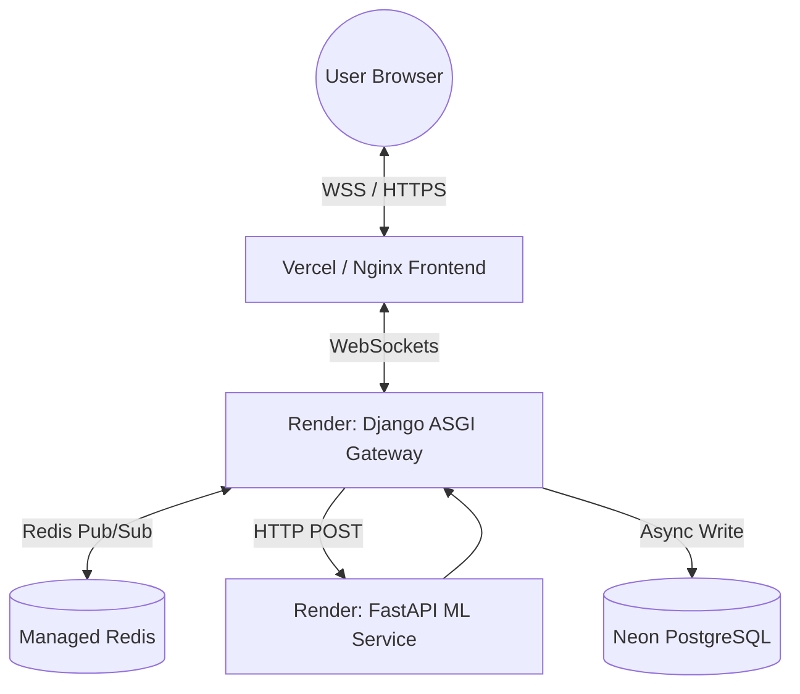
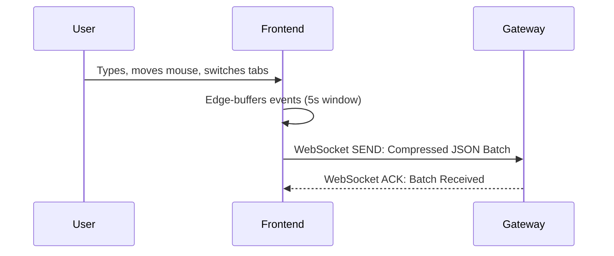
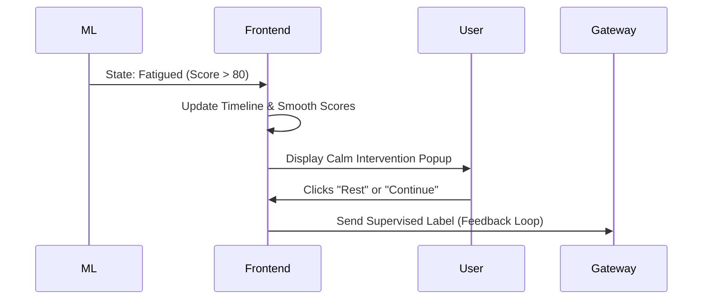

# Realtime Behavioral Signal Intelligence Platform

A human-aware adaptive computing system that uses real-time behavioral signals to infer cognitive load and provide dynamic, context-aware interventions.

 *(Hero Screenshot: Dark command center featuring live timeline, focus/fatigue bars, active intervention banner, gateway health, and feature importance panel)*

> **Abstract:** This platform operates as a production-oriented systems engineering platform showcasing realtime telemetry processing, sliding-window feature engineering, and human-in-the-loop inference systems. It moves beyond static productivity trackers by passively analyzing *how* a user interacts, designed to actively preserve cognitive efficiency and reduce digital fatigue.

---

## 🧠 System Capabilities

- Realtime cognitive state inference
- Sliding-window behavioral analysis
- Adaptive fatigue intervention system
- Human-in-the-loop ML feedback collection
- Explainable prediction outputs
- Low-latency WebSocket telemetry streaming
- Resilient reconnect + buffering architecture
- Dockerized microservice deployment

---

## ⚡ System Benchmark Metrics

The platform is engineered for high-performance stream processing and low-latency feedback loops:
- **< 200ms Realtime Inference Latency**: Ensuring adaptive interventions feel immediate and seamless.
- **30-Second Sliding Behavioral Windows**: Providing temporal stability and context to ML predictions.
- **5-Second Compressed Telemetry Streaming**: Drastically reducing network payload overhead without sacrificing behavioral granularity.
- **< 2s WebSocket Reconnect Recovery**: Leveraging local edge-buffering to ensure zero data loss during network interruptions.

---

## 🛠️ Tech Stack

### Frontend
- React
- Vite
- Tailwind CSS
- Zustand
- Recharts

### Backend Gateway
- Django
- Django Channels
- Redis
- DRF

### ML Service
- FastAPI
- Pandas
- Scikit-Learn
- NumPy

### Infrastructure
- Docker
- Docker Compose
- Render
- Vercel
- PostgreSQL (Planned)

---

## 🏗️ Architecture Overview

The system operates on a continuous, closed-loop intelligence cycle, fully containerized via Docker for reliable deployment:

`Edge Telemetry` ➔ `ASGI Gateway Ingestion` ➔ `ML Inference Engine` ➔ `Adaptive UI Updates` ➔ `Human Feedback Loop`

 *(Diagram Placeholder: Exported high-level system architecture PNG)*

### ⚙️ Key Engineering Challenges Solved

#### Preventing WebSocket Event Flooding
Raw browser telemetry generates hundreds of events per second. To prevent overwhelming the gateway, the frontend performs edge-side aggregation and compression before transmitting batched telemetry every 5 seconds.

#### Stabilizing Noisy Human Behavior
Human interaction data is inherently volatile. Sliding windows and exponential moving averages were implemented to smooth prediction instability and avoid erratic UI interventions.

#### Maintaining Realtime Responsiveness
The inference engine was separated into a dedicated FastAPI microservice to ensure CPU-heavy feature engineering never blocks asynchronous WebSocket traffic.

#### Reliable Telemetry Delivery
A resilient reconnect and local queueing mechanism ensures telemetry batches survive temporary disconnects without data loss.

### Deep-Dive: Architectural Decisions & Rationale

Building a seamless real-time cognitive engine required solving several complex systems-engineering problems. Here is the rationale behind the core architectural decisions:

#### Why Django Channels + FastAPI Split?
Instead of a monolithic backend, the architecture explicitly decouples **I/O-bound routing** from **CPU-bound computation**. 
- **Django Channels (with Redis):** Acts as the highly concurrent ASGI Gateway, solely responsible for managing persistent WebSocket connections, authentication, and routing raw telemetry.
- **FastAPI:** Acts as the stateless ML inference engine. By separating this, heavy Scikit-Learn aggregations or Pandas matrix operations cannot block the async event loop of the WebSocket gateway, allowing the inference nodes to scale horizontally independent of the connection nodes.

#### Why Sliding Windows?
Raw interaction data (like a sudden 2-second typing pause) is highly volatile. If we ran inference on static 5-second intervals, the AI's predictions would jump erratically. By implementing an **in-memory 30-second sliding window aggregator**, the model "remembers" the immediate past. This provides continuous temporal context, allowing the system to recognize sustained fatigue rather than momentary hesitation.

#### Why Edge Compression?
Streaming every single `mousemove` or `keyup` event over a WebSocket would result in massive network flooding, draining client battery and overwhelming the gateway. Instead, the React frontend acts as an **edge-preprocessing layer**, aggregating hundreds of micro-events locally and transmitting a highly compressed, structured JSON summary only once every 5 seconds.

#### Why Temporal Smoothing?
Even with sliding windows, human behavior is noisy. A user might briefly glance away, causing a temporary spike in the 'distraction' score. We implemented **Exponential Moving Average (EMA) temporal smoothing** on the backend (`current_score = (prev * 0.7) + (new * 0.3)`) and strict state transition constraints. This guarantees that UI interventions (like suggesting a break) only trigger when a cognitive state is genuinely persistent, preventing notification fatigue.

---

## 📊 Example Cognitive Prediction Output

```json
{
  "state": "Fatigued",
  "focus_score": 32,
  "fatigue_score": 84,
  "confidence": 89,
  "top_factors": [
    "High idle ratio",
    "Elevated error rate",
    "Long typing pauses"
  ]
}
```

---

## 🐳 Deployment Architecture

The entire platform is built with infrastructure-as-code principles and is fully containerized.



**To run the production-grade environment locally:**
```bash
docker compose up --build
```
*Services are orchestrated with strict `depends_on` service ordering, named volumes for Redis, and curl-based health checks ensuring the ML service is ready before traffic is routed.*

### Local configuration & database migrations (Phase A)

1. **Apply Django migrations** (first run, or after model changes). With Compose running:
   ```bash
   docker compose exec backend-gateway python manage.py migrate
   ```
   For a local virtualenv instead of Docker: `cd backend-gateway && python manage.py migrate`

2. **Environment variables** — Copy the root `.env.example` into `.env` and adjust. Important keys:
   - **Gateway:** `DJANGO_SECRET_KEY`, `DJANGO_DEBUG`, `DJANGO_ALLOWED_HOSTS`, `ML_SERVICE_URL`, `DATABASE_URL`, `REDIS_URL`
   - **Frontend (Vite):** `VITE_API_BASE_URL`, `VITE_GATEWAY_WS_URL`, `VITE_ML_BASE_URL` (see `frontend/.env.example`). Docker builds bake these in via build args in `docker-compose.yml`.
   - **Demo / mock generator:** Either set `ALLOW_DEV_INSECURE_TELEMETRY=1` on the gateway **only in local debug** (connects WebSocket without JWT using a shared `telemetry_dev` user), **or** keep it off and set `DEMO_GATEWAY_JWT` on the ML service to a real access token so `scripts/mock_generator.py` can authenticate.

### Phase B — Feedback storage, export, and Random Forest inference

1. **Human-in-the-loop** — The UI posts to **`POST /api/feedback/`** on the gateway with `Authorization: Bearer <access>`. Rows are stored in **`HumanFeedback`** (with `features_snapshot` and optional link to **`CognitivePrediction`** via `gateway_prediction_id` from WebSocket payloads).

2. **Export training data** (JSONL, one object per line):
   ```bash
   cd backend-gateway
   python manage.py export_feedback_dataset > ../feedback.jsonl
   ```

3. **Train the RF** (writes `ml-service/models/rf_cognitive.joblib` + `rf_cognitive.meta.json`; paths are gitignored by default):
   ```bash
   cd ml-service
   python scripts/train_rf.py ../feedback.jsonl
   ```

4. **Inference** — If both artifact files exist, **`POST /api/infer`** uses **Random Forest** (`v2_random_forest`) and returns **`feature_importances`**; otherwise it falls back to **heuristics** (`v1_heuristic`). The legacy **`POST /api/feedback`** on the ML service returns **410**; use the gateway only.

---

## 🔄 System Flow Diagrams

### 1. Telemetry Ingestion Flow



 *(GIF Placeholder: Telemetry generation)*

### 2. Adaptive Intervention Flow



 *(GIF Placeholder: Fatigue intervention triggered)*

---

## 🚀 Future Scalability

The architecture was intentionally designed to remain agnostic to the *type* of telemetry it receives, allowing it to seamlessly scale into a fully multimodal intelligence platform:
- **Persistent User Intelligence:** Upgrading the current ephemeral sessions with JWT Auth and PostgreSQL to unlock weekly burnout trend analysis and productivity heatmaps.
- **Multimodal AI Integration:** Fusing the existing keyboard/mouse telemetry with webcam micro-expressions, posture detection, and eye-tracking streams.
- **Behavioral Drift Detection:** Automatically detecting when a user's baseline interaction patterns permanently shift due to skill acquisition or ergonomic changes.
